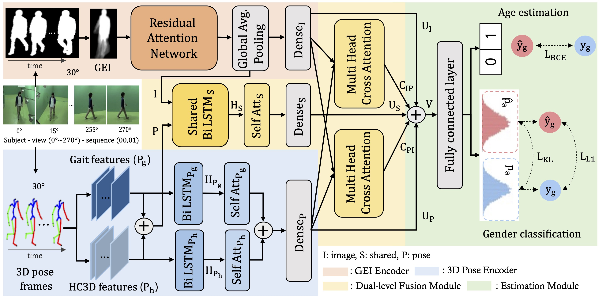
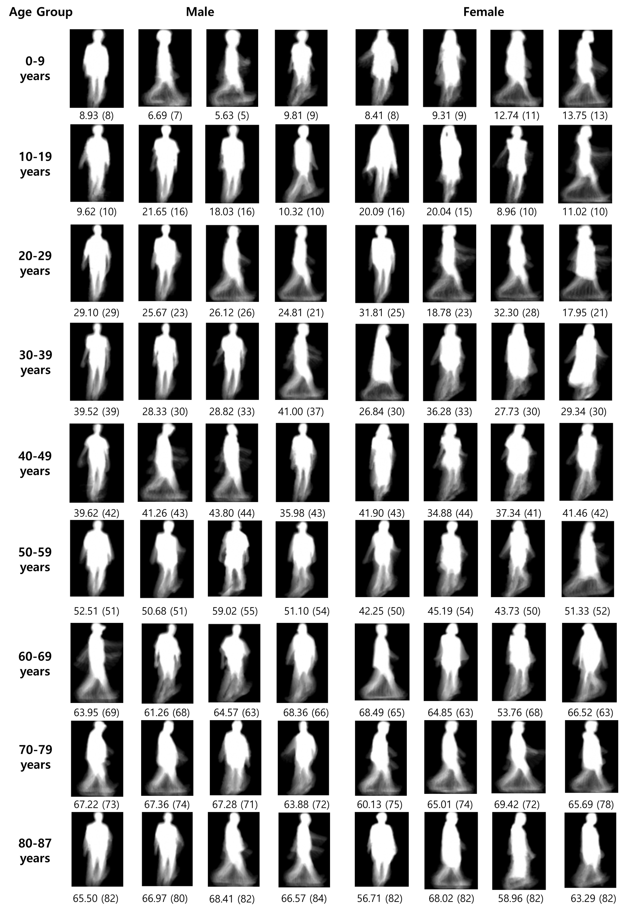

# GaitMix 
The PyTorch implementation of our CVPR 2024 paper "GaitMix: Integrating Multi-View Silhouette and 3D Pose for Soft Biometrics Recognition"

We introduce GaitMix, a soft biometric recognition model integrating multi-view silhouette and 3D pose. Illustrated in the below Figure, our model has four architectural components: silhouette encoder, 3D pose encoder, dual-level fusion module, and estimation module.



## Updates
[Updated on 11/27/2023] Revised the overall code & read me file.
[Updated on 11/06/2023] Released a code for GaitMix.

## Example Results
Some soft biometrics recognition results on the OUMVLP dataset. The left value indicates ground truth and the right value is estimated age.



## Training GaitMix
The training of our GaitMix includes four stages: 1. download the datasets (i.e., OUMVLP and OUMVLP-Mesh); 2. extract three features; 3. split data into train, validation, and test set; 4. Train GaitMix.

1. Data preparing
We use both OUMVLP and OUMVLP-Mesh datasets in experiments and you can download the dataset here: <http://www.am.sanken.osaka-u.ac.jp/BiometricDB/GaitMVLP.html>

2. Feature extraction
We extract three types from two modalities (e.g., silhouette and 3D pose)
- GEI features
- HC3D features
- gait features
You can extract them by executing FeatureExtraction.py

```
python FeatureExtraction.py
```

3. Data Split
We split the dataset to train, validate, and test sets. You can split dataset by executing DataSplit.py

```
python DataSplit.py
```

4. Train the model
You can train our model by conducting Train.py

```
python Train.py
```

## Testing GaitMix
If you want to test our model, you need a training weight file, data keys, and extracted features from the mentioned procedure.
You can test our model by conducting Test.py

```
python test.py
```

